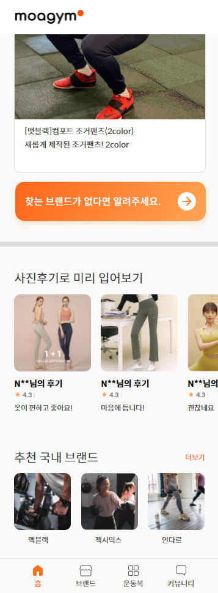
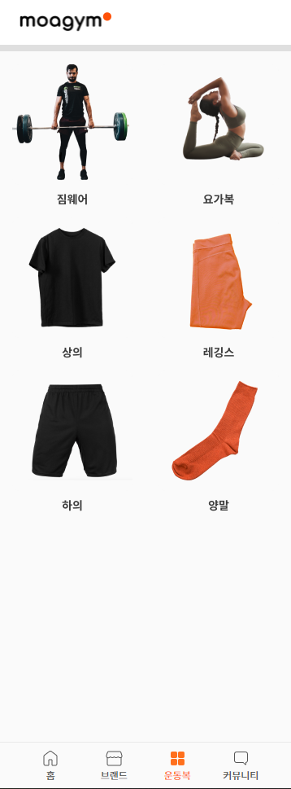
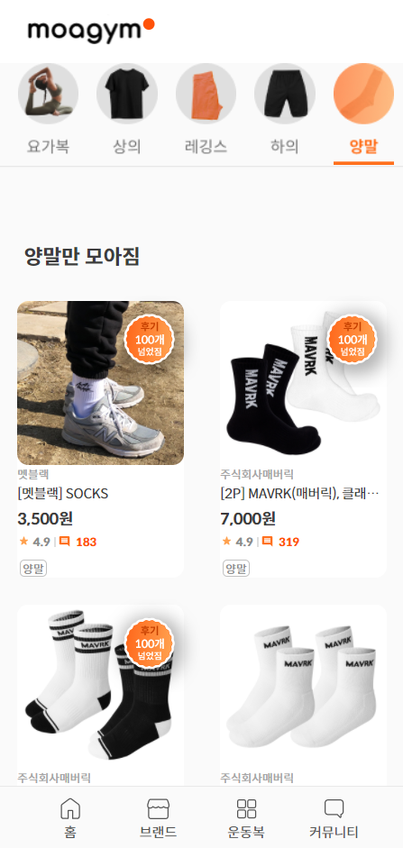
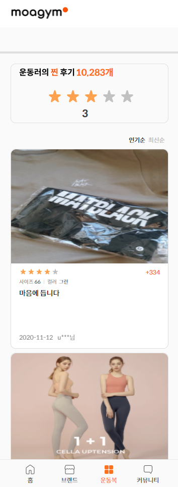

MoaGym
===
MoaGym 은 무신사 같은 국내 의류 쇼핑몰처럼 헬스, 요가, 필라테스 등의 의류 만을 모아서 보여주자는 의미로 시작한 프로젝트입니다.

[stack](#stack)
[structure](#structure)
[update](#update)
[screenshot](#screenshot)
[try](#try)
[build](#buildWith)

### stack

- html
- css-in-js(styled-component)
- typescript
- react
- redux(ducks pattern)

### structure

```
common
    - store 및 공통으로 사용할 모듈
interface
    - 인터페이스 모듈  
pageComponent
    - 페이지 컴포넌트
sharedComponent
    - 공통 컴포넌트

```

### update

날짜 내림차순 기준으로 커밋 및 필요한 기록을 정리

- 21.03.09 project clone & readme update

### screenshot








### try


### buildWith

