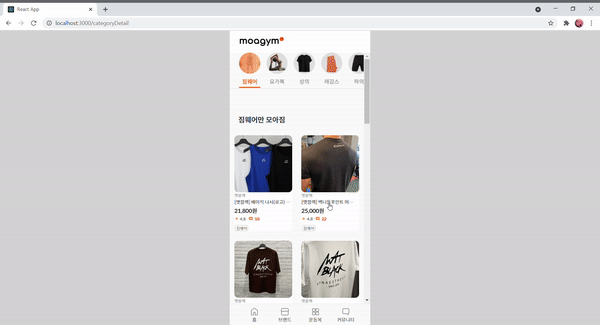
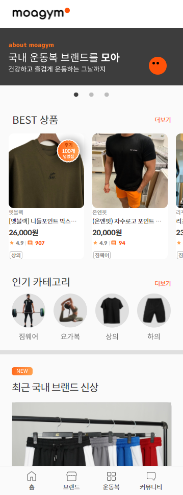
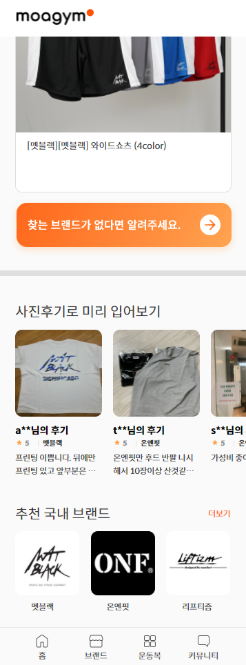
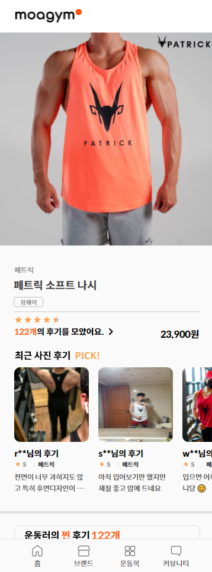
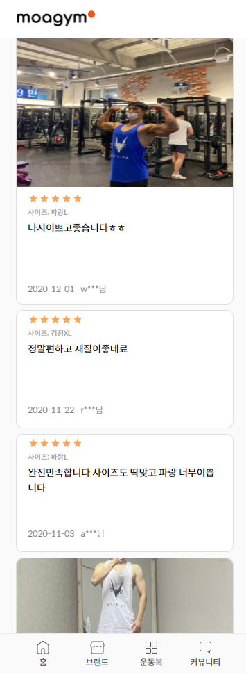
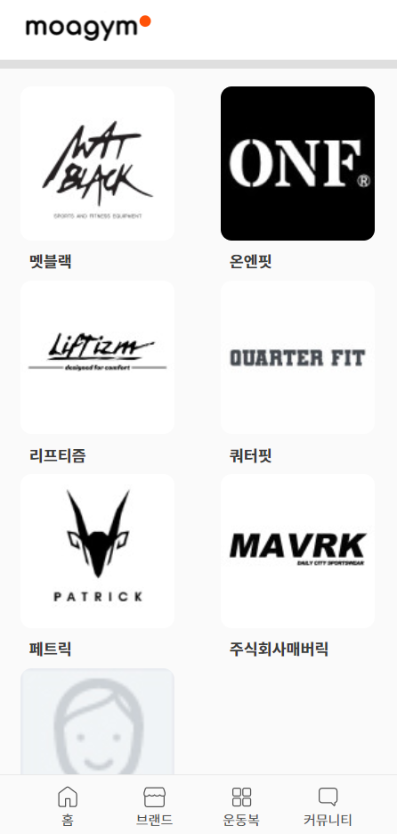
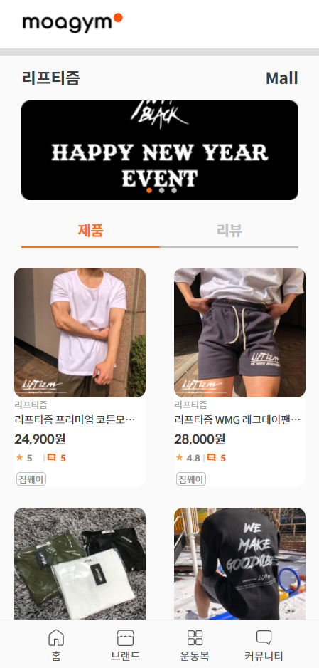

MoaGym
===
MoaGym 은 무신사 같은 국내 의류 쇼핑몰처럼 헬스, 요가, 필라테스 등의 의류 만을 모아서 보여주자는 의미로 시작한 프로젝트입니다.

- [stack](#stack)
- [structure](#structure)
- [update](#update)
- [screenshot](#screenshot)
- [try](#try)
- [buildWith](#buildWith)

### stack

- html
- css-in-js(styled-component)
- typescript
- react
- redux(ducks pattern)

### structure

```
common
    - store 및 공통으로 사용할 모듈
interface
    - 인터페이스 모듈  
pageComponent
    - 페이지 컴포넌트
sharedComponent
    - 공통 컴포넌트

```

### update

날짜 내림차순 기준으로 커밋 및 필요한 기록을 정리

- 21.04.20
    - github page에 배포
    - 최적화, 테스트 관련 공부 시작

- 21.04.12
    - 스크롤에 대한 문제점 발견
    - 직전에 구현한 무한스크롤은 성능상으로 많은 문제가 있어서, 오히려 사용하지 않는 것이 사용자 경험에 좋다는 판단
    - 이유는?
        - 현재의 무한스크롤은 데이터를 하단에 추가시키는 기능밖에 없기 때문에, 다른 페이지로 이동했다가 뒤로가기를 이용해서 돌아오게 되면 무한스크롤을 이용해 이동했던 위치로 되돌아가는데 문제가 발생함
        - 물론 Storage를 활용해서 어디까지 스크롤했는지 저장해두고 이를 사용한다면 상관없지만, 이 경우에도 뒤로가기로 돌아왔을 때 일정 인덱스까지 전부 받아와서 렌더링 한 후에 보여지게 되므로 시간적으로 문제가 발생함
        - 마찬가지로 무한스크롤을 사용하는 경우 위에 쌓여가는 DOM들의 메모리를 off 시키지 않았으므로 메모리 과부하가 발생할 가능성이 매우 높음
    - 문제해결
        - 고민 끝에 인덱스 2개를 활용해서 일정 구간의 데이터만 렌더링하는 방법을 사용해보기로 결정!
    - 구현
        - 가장 먼저 startIndex, endIndex 그리고 일정 구간을 '구별하기 위한' 변수 midIdx를 사용
        - midIdx의 위치에 존재하는 DOM을 직접 접근해서 그 엘리먼트의 위치를 계산하는데, 스크롤이 내리면서 DOM이 사라진다면 midIdx의 위치를 증가시켜주는 작업을 해야함
        - 마찬가지로 스크롤을 올리면서 DOM이 사라진다면 감소시켜주는 작업을 해야함
        - 중요한 것은 startIdx, endIdx의 값이 변화함에 따라 midIdx도 변화하게 되는데, midIdx는 startIdx, endIdx의 중간값이 아니라는 것이 포인트이고, 그러므로 startIdx와 endIdx의 값을 일정하게 유지하기 위한 작업을 아래와 같이 해주어야함
        ```
        if(midIdx.current>6) MidElement = ((elements.current as HTMLDivElement).childNodes[6] as HTMLDivElement).getBoundingClientRect();
        else MidElement = ((elements.current as HTMLDivElement).childNodes[midIdx.current] as HTMLDivElement).getBoundingClientRect();
        const preStart = startIdx.current;

        if(MidElement.y < 0){
            midIdx.current += 2;
            
            // 중간값이 start ~ end 중간값보다 크다면 갱신해줄 필요가 있다
            if((startIdx.current+endIdx.current)/2 <= midIdx.current){
                startIdx.current += 2;
                endIdx.current += 2;
            }

            if(endIdx.current >= product.length){
                endIdx.current -= 2;
                startIdx.current -= 2;
            }
        }
        else if(MidElement.y > clientHeight){
            midIdx.current -= 2;
            
            // 중간값이 start ~ end 중간값보다 작다면 갱신해줄필요가 있다
            if((startIdx.current+endIdx.current)/2 >= midIdx.current){
                startIdx.current -= 2;
                endIdx.current -= 2;
            }

            if(startIdx.current < 0){
                startIdx.current += 2;
                endIdx.current += 2;
            }
        }
        console.log(startIdx.current, "부터" ,endIdx.current, "까지 가져옵니다");
        if(preStart !== startIdx.current){
            const getProduct = product.slice(startIdx.current, endIdx.current);
            setVerticalProduct(getProduct);
        }
        ```
        - 일정 구간(0~13)내의 midIdx값이 벗어나면 항상 참조하게 될 중간값을 고정시키기 위해 6이라는 값을 사용함

    - 결과
        

    - instagram 의 무한스크롤을 확인해보니 instagram은 일정구간을 사용하여 무한스크롤을 진행하되, 스크롤을 작업간 padding 값을 사용한다. 읽어보고 가능하다면 직접 적용해보는 경험도 해봐야겠다.<div>

    - next todo 
        - 뒤로가기 버튼에 대한 페이지 셋팅 작업<div>

- 21.04.10
    - add Loading component, Infinity scroll(review)
        - Loading component
        - 2가지의 로딩 컴포넌트를 구현하였다.
        1. 데이터 처리에 대한 초기 화면 로딩 컴포넌트 구현
        2. 이미지의 로딩 여부에 따른 컴포넌트 구현
            - 2번 컴포넌트를 구현하면서 아래와 같은 문제점 발견
            ```
            React Hook "useCommaNumber" is called conditionally. React Hooks must be called in the exact same order in every component render.
            ```
            - 위 에러코드의 useCommaNumber는 element 내부에서 script를 사용하여 숫자에 콤마를 찍어주는 함수인데, 로딩 컴포넌트와 함께 조건부 렌더링으로 사용하면서 에러가 발생했다.
            - [공식문서](https://ko.reactjs.org/docs/hooks-rules.html#explanation)를 통해서 hook의 규칙에 대해 공부하고, useCommaNumber를 초기에 계산하여 렌더링을 하여 문제를 해결했다.

        - infinity scroll : review 컴포넌트에 적용완료<div>
    - update categorys In HomePage
        - 홈페이지 내의 카테고리항목별로 detail 페이지로 이동할 수 있도록 적용<div>

    - next todo
        - 이미지가 있는 리뷰에 대해서 이미지를 클릭 시 모달창 띄우기(닫기버튼, 다른 곳 클릭시 닫기)

- 21.04.08
    - feature Infinity scroll(product)
        - 성능 개선을 위해 스크롤을 계산하여 데이터를 추가하는 Infinity scroll을 구현 
        - 구현방법
            - GNB을 제외한 중간 엘리먼트의 스크롤을 scrollHeight, clientHeight, scrollTop 을 사용하여 계산
            - scrollTop은 정수가 아닌 실수로 계산되어 scrollTop + clientHeight >= scrollHeight 인 경우 스크롤이 하단 끝에 도달한 것으로 간주
            - 리스트에 뿌려줄 데이터를 초기에 전부 받아놓고, 컴포넌트의 상태가 바뀌어도 유지되는 변수를 사용하기 위해 useRef로 데이터를 slice할 기준값인 startIdx, endIdx를 설정
            - 리스트를 사용할 컴포넌트가 마운트되면 스크롤이 적용될 돔에 scroll 이벤트를 등록
            - 또한 이벤트 제거를 위해 컴포넌트가 언마운트 될 때 이벤트를 제거
            - 데이터를 가진 product가 prop으로 주어지면 컴포넌트의 상태값에 원하는 초기값 길이만큼 데이터를 초기화하고 설정한 startIdx, endIdx 역시 길이만큼 설정
            - scroll 이벤트가 계산되다가 하단 끝에 도달하면 기존 데이터인 product에서 startIdx~endIdx만큼 slice하여 상태값 변경<div>

        - 막힌 부분
            - categoryDetail 페이지 상단에는 shared component인 category navigation component(as CN)가 존재하는데, 이 CN을 통해 다른 카테고리를 선택한 후에 스크롤을 통해 데이터를 업데이트 받으면 이전 카테고리의 데이터가 덮어쓰여지는 현상이 있었다<div>
        
        - 해결
            - 문제 원인은 의존성 배열을 잘못 입력했기 때문이었다
            - 처음에는 스크롤 이벤트 등록을 product props 가 변경될 때만 DOM에 추가해주면 된다고 생각했는데, 이렇게 하면 현재 사용할 상태값인 verticalProduct 가 product 에 의해 변경되어도 verticalProduct에 대한 최신 정보를 유지하지 못하기 때문이었다
            - 이 문제를 해결하는데 꽤 오랜 시간이 걸렸지만, 다시 한번 의존성 배열을 정확히 입력하는 것에 대한 중요성을 알아갈 수 있었다<div>

        - 결과<div>
            <div>

    - next todo
        - 오늘 구현한 Infinity slide 리뷰 컴포넌트에도 적용시키기(상)
        - 각 컴포넌트의 loading 화면 만들고 적용시키기(중)
        - custom Hook 복습(하)
        - 코드 재정독 및 최적화(Memo 적용시키기)(하)<div> 

- 21.04.06
    - add Page brandList, brandPage
        - brandList : 브랜드 리스트를 한눈에 확인할 수 있도록 Shared-ProductList의 vertical, horizontal 을 이용하여 표현
        - brandPage : 각 브랜드 페이지는 react-router-dom의 history를 통해서 brand/brandName 로 라우팅되고, location{pathname, state}를 통해서 주소에 맞는 브랜드 데이터를 처리하여 표현함, 브랜드 아이템에 대한 상품 및 리뷰를 한번에 볼 수 있도록 표현함
    <br><br>
    - update Category Tag data : 각 브랜드 아이템들의 태그를 이용하여 데이터를 분류함  
    <br><br>
    - fix Image : 기존에 사용하던 vector 이미지인 .svg 파일을 bitmap 이미지인 .png로 수정하여 속도 개선
    <br>
    - study
        - lodash (@types/lodash)
            ```
            newFoo = _.cloneDeep(foo)
            newFoo 에는 기존 변수 foo의 깊은 복사를 통한 새로운 참조변수를 반환하여 불변성을 쉽게 사용할 수 있다.
            ```
    <br>
    
    - next todo
        - 필터기능을 사용하지 않거나 하단 스크롤시 데이터를 추가하는 기능을 사용하지 않는다면 많은 데이터를 화면에 렌더링하는 시간이 오래 걸리므로 필수적으로 공부해야겠다.
        - vertical Product List에 필터기능 추가하기
        - 스크롤이 하단에 있을 경우 데이터 추가하는 기능 공부해보기
    <br><br>
- 21.03.28
    - use API
    - update Home, ItemInfo Pages
    - 브랜드 이름을 우선 받은 후에, 각 브랜드 이름을 이용하여 API를 호출
    - 각 브랜드 이름으로 fetch 하기 위해서는 단일 promise로는 pending 처리여부를 알 수 없기 때문에 Promise.all 을 사용
    <br>
    - study
        불변성이 제대로 이루어지지 않아 확인해보니 단일 참조값 뿐만 아니라 객체 내부 속성값 역시 단순 대입으로는 서로 참조한다는 것을 알았고, 금일 작업은 내부 객체를 직접 참조하였지만 비효율적임을 느꼈다. 상태값 변경을 원활히 하기 위해 불변성에 관련된 라이브러리를 사용할 수 있도록 공부해야겠다.
    <br>
    - next todo
        - add brandPage, brandListPage
    <br><br>
- 21.03.10
    - GNB component move to shared-component
    - bug : product click event 
    product component 를 클릭한 상태로 스크롤을 진행하면 스크롤 종료 후 클릭 이벤트가 실행되어서 ItemInfo Component로 페이지 이동이 발생<br>
    fix : 스크롤은 mousedown -> mousemove -> mouseup | mouseleave 의 순서로 진행되는데, 여기서 product component에 click 이벤트를 사용한다면 click 이벤트는 가장 마지막에 실행되므로 click 이벤트를 사용하면 이 버그를 해결할 수 없다고 생각했다. 그래서 click event 를 mousedown + mouseup 이벤트로 변경하여 버그를 수정했다.
    <br>
    - DataType 정리
    <br><br>
- 21.03.09 
    - project clone & readme update

### screenshot

- homePage <br>

- homePage <br>

- categoryPage <br>

- categoryDetailPage <br>

- itemInfoPage <br>

- itemInfoPage <br>

- brandListPage <br>

- brandPage(product) <br>

- brandPage(review) <br>


### try

[배포주소](https://junho0956.github.io/MoaGym/)

### buildWith

|Name|Part|
|:---:|:---:|
|예아정|Design|
|김현우|Design|
|김준호|Frontend|
|[최상후](https://github.com/Neungji-Baksal)|Backend|