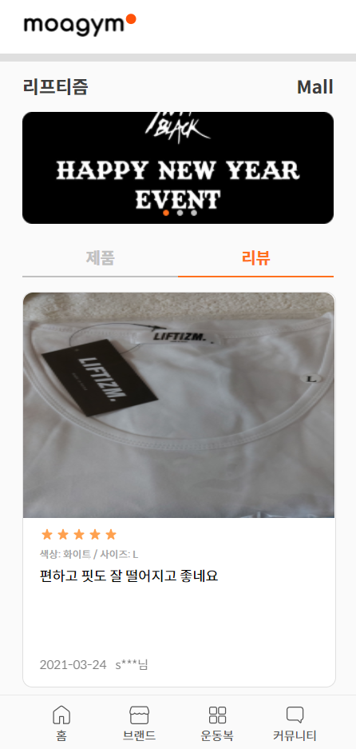

MoaGym
===
MoaGym 은 무신사 같은 국내 의류 쇼핑몰처럼 헬스, 요가, 필라테스 등의 의류 만을 모아서 보여주자는 의미로 시작한 프로젝트입니다.

- [Stack](#Stack)
- [기록](#commits)
- [screenshot](#screenshot)
- [try](#try)
- [Team](#Team)

### Stack

- html
- styled-component
- typescript
- react
- redux

### <a name="commits">기록</a>

[21.04.26](./Readmes/21_04_26.md) 
[21.04.21](./Readmes/21_04_21.md) 
[21.04.20](./Readmes/21_04_20.md) 
[21.04.12](./Readmes/21_04_12.md) 
[21.04.10](./Readmes/21_04_10.md) 
[21.04.08](./Readmes/21_04_08.md) 
[21.04.06](./Readmes/21_04_06.md) 
[21.03.28](./Readmes/21_03_28.md) 
[21.03.10](./Readmes/21_03_10.md) 
[21.03.09](./Readmes/21_03_09.md) 

### 결과물

    
    
    
    
    
    
    
    
    

### Design structure

### try

현재 AWS 서비스 기간이 끝나 서버가 내려갔습니다..
곧 서버를 다시 올릴 예정입니다.
[배포](https://junho0956.github.io/MoaGym/)

### Team

|Name|Part|
|:---:|:---:|
|예아정|Design|
|김현우|Design|
|김준호|Frontend|
|[최상후](https://github.com/Neungji-Baksal)|Backend|